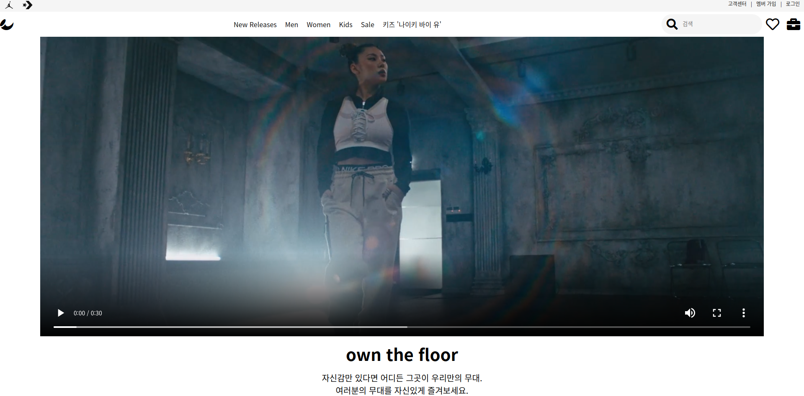
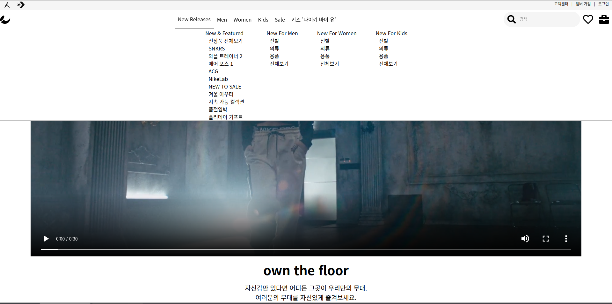
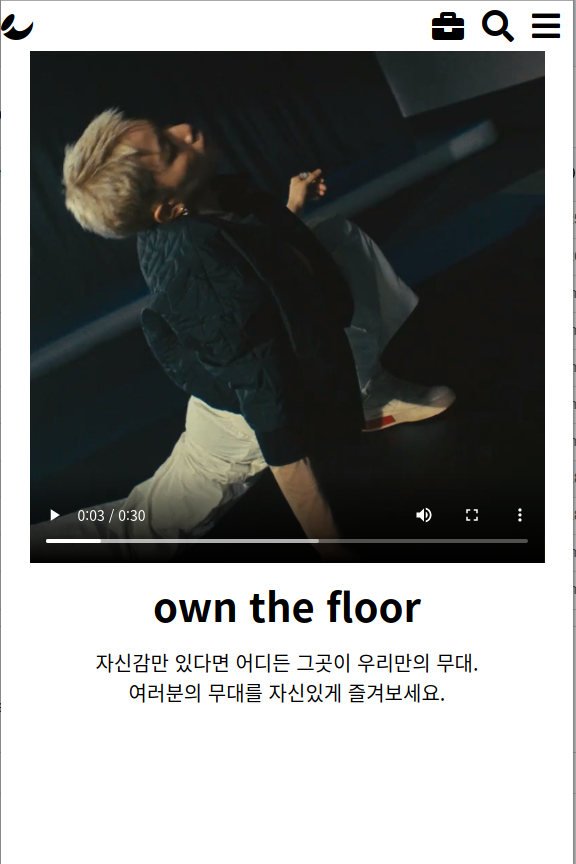
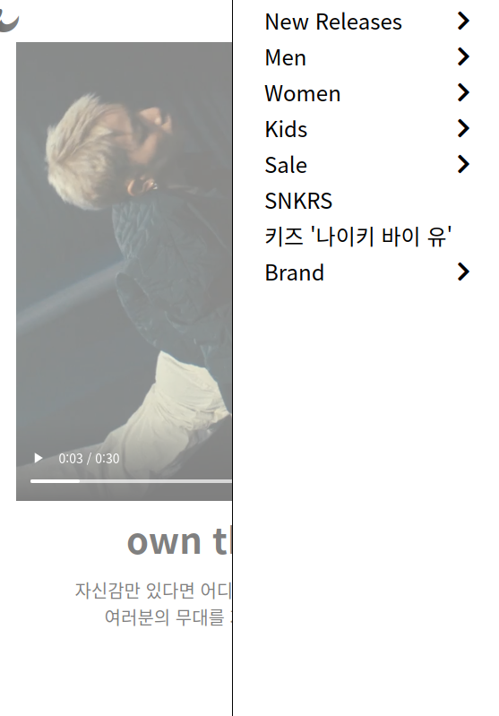

<h3 align="center">favorite brand nike clone coding</h3>
 
<h6 align = 'center'> make typical board and learn responsive web </h6>

<h3 align="center">capture</h3>

 
initial screen
 

 
drop down navigation bar: when hovered, show menus 
 

 
when the screen size becomes smaller than a certain value. 
 

 
when side menu bar is clicked, show side menus and other screen is blurred

